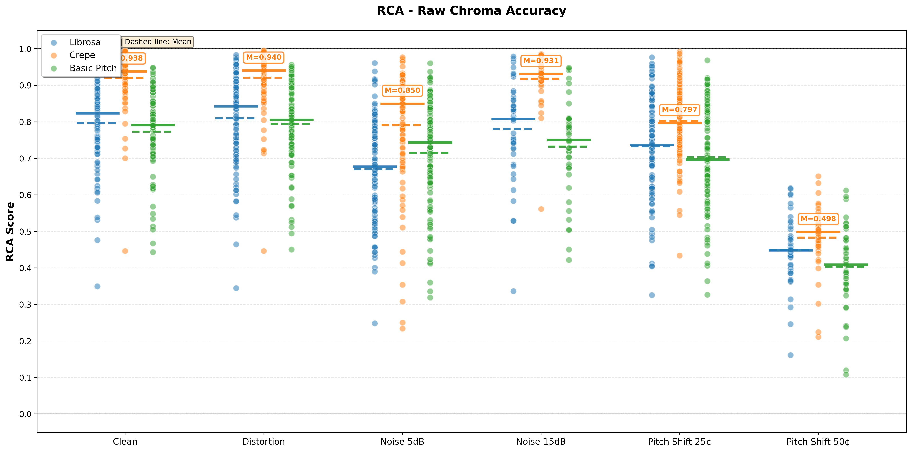

# Benchmark-PitchTracking-in-Non-ideal-Conditions

## Overview  
This repository contains the code and data pipelines for our **Pitch Tracking Benchmark Project**, developed as part of the Fall 2025 final project for the Music Information Retrieval course at NYU.  
The goal of this project is to evaluate how pitch tracking models behave under different real-world recording conditions. We focus on three types of augmentations—**noise**, **distortion**, and **tuning changes**—and apply them to the MedleyDB-Pitch dataset. The processed audio and updated annotations are then used to benchmark models such as **CREPE** and **BasicPitch**.

---

## Data Processing  

All processing is based on the pitch subset of the **MedleyDB** dataset  
👉 https://medleydb.weebly.com/  

For each augmentation, we maintain the original ratio of vocal and instrumental tracks.  
Vocal and instrumental tracks are separated and evenly split across the augmentation levels or catagories.

The following sections describe the three augmentation pipelines: distortion, noise, and tuning.

---

### 1. Distortion Augmentation  

We apply a tanh-based nonlinear distortion to each stem.  
The core formula used is:

Soft clip: y_out = tanh(g * y_in)

We implement LUFS-based loudness matching to keep perceived volume consistent with the original signal.

We define **three distortion levels**, corresponding to the following gain parameters:

- **Light**: \( g = 2.0 \)  
- **Medium**: \( g = 5.0 \)  
- **Heavy**: \( g = 7.5 \)

Each audio file is distorted once based on the level listed in the dataset manifest.  
File names and folder structures remain unchanged to preserve compatibility with `mirdata`.  
The Distorted dataset can be found [here](https://drive.google.com/drive/folders/1AkUr0t0VZ3CfEQ80TXEfF15WW-LerpeB?usp=sharing)

---

### 2. Noise Augmentation  

We add three types of environmental noise to each audio file:

1. **Room noise**  
   - Recorded in the NYU Education Building  
2. **Street noise**  
   - https://youtu.be/YF3pj_3mdMc?si=BSpCD-tEzvVaixAu  
3. **People noise**  
   - https://youtu.be/Q5jiitmLBOY?si=2MW1ZHiUiLLV_Pmw  

Noise is mixed into the audio at two signal-to-noise ratios:

- **15 dB SNR**  
- **5 dB SNR**

As with distortion, we preserve the original MedleyDB folder layout for seamless loading via `mirdata`.  
The Noised dataset can be found [here](https://drive.google.com/drive/folders/1Hx9Cab-a-cAM_Scs9dsTQX6YMCn495dz?usp=sharing)

---

### 3. Tuning Augmentation  

For tuning manipulation, we apply **global pitch shifts** to both the audio and the corresponding pitch CSV annotations.

We include 2 different levels of tuning:

- **±25 cents**  
- **±50 cents**  

This creates versions of each track that simulate real-world tuning drift while keeping time alignment intact.  
The Detuned dataset can be found [here](https://drive.google.com/drive/folders/1MmaDZANaJJ_qgiJKc1h_3Y4mac7xmzVu?usp=sharing)

---

## Model Evaluation

We evaluate three pitch tracking algorithms on the augmented datasets:

1. **Librosa** (`librosa.pyin`)
   - Signal processing-based pitch tracking method
   - CPU implementation with multiprocessing support

2. **CREPE** (Convolutional Representation for Pitch Estimation)
   - Deep learning-based monophonic pitch tracking
   - Uses full model capacity

3. **Basic Pitch**
   - Lightweight polyphonic note transcription model developed by Spotify
   - Supports multipitch estimation

### Experimental Conditions

We evaluate all models under 6 experimental conditions:
- **Clean**: Original audio (baseline)
- **Distortion**: Audio distortion
- **Noise 5dB**: Added 5dB noise
- **Noise 15dB**: Added 15dB noise
- **Pitch Shift 25cents**: Pitch shifted by 25 cents
- **Pitch Shift 50cents**: Pitch shifted by 50 cents

---

## Usage

### Setup

Install required dependencies:

```bash
pip install librosa pandas numpy scipy matplotlib seaborn tensorflow crepe resampy pretty_midi
```

### Project Structure

```
Final_Project/
├── src/
│   ├── utils/                    # Processing scripts
│   │   ├── process_basic_pitch.py
│   │   └── process_crepe.py
│   ├── normalization/            # Normalization module
│   │   ├── format_converter.py
│   │   └── renormalize_all.py
│   ├── evaluation/               # Evaluation module
│   │   ├── evaluator.py
│   │   └── metrics.py
│   ├── librosa_tracker.py       # Librosa tracker
│   ├── basic-pitch-main/         # Basic Pitch library
│   └── crepe-master/             # CREPE library
├── evaluate/                     # Evaluation scripts
│   ├── evaluate_basic_pitch.py
│   ├── evaluate_crepe.py
│   ├── evaluate_librosa.py
│   └── plot_results.py          # Plotting script
├── results/
│   ├── predictions/              # Prediction results
│   ├── metrics/                  # Evaluation metrics CSV files
│   └── figures/                  # Generated plots
└── MedleyDB-Pitch/               # Dataset
```

**Note**: All scripts must be run from the project root directory.

### 1. Generate Predictions

#### Basic Pitch Predictions
```bash
python3 src/utils/process_basic_pitch.py
```
This processes all experimental conditions and generates:
- Raw predictions: `results/predictions/basic_pitch/`
- Normalized predictions: `results/predictions/basic_pitch_normalized/`

#### CREPE Predictions
```bash
python3 src/utils/process_crepe.py
```
Generates:
- Raw predictions: `results/predictions/crepe/`
- Normalized predictions: `results/predictions/crepe_normalized/`

#### Librosa Predictions
Librosa predictions are already completed. Results are in:
- `results/predictions/librosa/`
- `results/predictions/librosa_normalized/`

### 2. Evaluate Predictions

The evaluation scripts compute metrics for each audio file and save them as CSV files.

#### Evaluate Basic Pitch
```bash
python3 evaluate/evaluate_basic_pitch.py
```
Output: `results/metrics/basic_pitch_*.csv`

#### Evaluate CREPE
```bash
python3 evaluate/evaluate_crepe.py
```
Output: `results/metrics/crepe_*.csv`

#### Evaluate Librosa
```bash
python3 evaluate/evaluate_librosa.py
```
Output: `results/metrics/librosa_*.csv`

### 3. Generate Comparison Plots

Run the plotting script to generate all comparison plots:

```bash
python3 evaluate/plot_results.py
```

This generates 4 plots (one for each metric), saved in `results/figures/`:
- `oa_comparison.png` - Overall Accuracy comparison
- `rpa_comparison.png` - Raw Pitch Accuracy comparison
- `rca_comparison.png` - Raw Chroma Accuracy comparison
- `vr_comparison.png` - Voicing Recall comparison

---

## Experimental Results

### Summary Table

The following table shows the average performance metrics across all experimental conditions:

| Model | Condition | OA | RPA | RCA | VR |
|-------|-----------|----|----|----|----|
| librosa | clean | 0.6589 | 0.8512 | 0.7966 | 0.7234 |
| librosa | distortion | 0.6703 | 0.8646 | 0.8092 | 0.7259 |
| librosa | noise_5db | 0.6453 | 0.7425 | 0.6696 | 0.7069 |
| librosa | noise_15db | 0.6933 | 0.8463 | 0.7798 | 0.7542 |
| librosa | pitch_shift_25cents | 0.6457 | 0.8073 | 0.7326 | 0.7281 |
| librosa | pitch_shift_50cents | 0.4746 | 0.4712 | 0.4480 | 0.6972 |
| crepe | clean | 0.5175 | 0.9607 | 0.9193 | 0.5403 |
| crepe | distortion | 0.4789 | 0.9625 | 0.9206 | 0.4997 |
| crepe | noise_5db | 0.4517 | 0.9142 | 0.7909 | 0.4997 |
| crepe | noise_15db | 0.4656 | 0.9711 | 0.9174 | 0.4805 |
| crepe | pitch_shift_25cents | 0.4606 | 0.9253 | 0.8018 | 0.4997 |
| crepe | pitch_shift_50cents | 0.2157 | 0.4883 | 0.4825 | 0.4480 |
| basic_pitch | clean | 0.7216 | 0.7923 | 0.7724 | 0.7978 |
| basic_pitch | distortion | 0.7237 | 0.8098 | 0.7942 | 0.7914 |
| basic_pitch | noise_5db | 0.7599 | 0.7393 | 0.7149 | 0.8057 |
| basic_pitch | noise_15db | 0.7649 | 0.7591 | 0.7319 | 0.8242 |
| basic_pitch | pitch_shift_25cents | 0.7101 | 0.7308 | 0.7028 | 0.7943 |
| basic_pitch | pitch_shift_50cents | 0.5826 | 0.4267 | 0.4026 | 0.7787 |

### Comparison Plots

The following plots compare the performance of all three models across different experimental conditions:

#### Overall Accuracy (OA)


#### Raw Pitch Accuracy (RPA)


#### Raw Chroma Accuracy (RCA)


#### Voicing Recall (VR)


---

## Prediction Results

### Raw Output Formats

Each algorithm produces pitch tracking results with different characteristics:

#### Librosa Output

**Time resolution**: 10ms (hop_length=160 at 16kHz sample rate)

**Example output**:
```
0.0,0.0
0.01,0.0
0.02,0.0
0.07,1779.0953213981911
0.08,1779.0953213981911
```

- Uses `librosa.pyin` for pitch estimation
- Outputs pitch estimates at regular 10ms intervals
- Unvoiced segments are marked as `0.0`
- Time stamps are generated using `librosa.frames_to_time()`

#### CREPE Output

**Time resolution**: 10ms (step_size=10ms)

**Example output**:
```
0.0,354.324393703952
0.01,53.24611311825794
0.02,52.90697570930432
0.03,52.735132752185415
```

- Deep learning model outputs pitch estimates at 10ms intervals
- Uses full model capacity for best accuracy
- May output non-zero frequencies even in unvoiced regions (handled during normalization)
- Time stamps are generated by CREPE's internal processing

#### Basic Pitch Output

**Time resolution**: ~5.8ms (hop_size_ms=5.8)

**Example output**:
```
0.0,0.0
0.0058,0.0
0.0116,0.0
0.0174,0.0
```

- Polyphonic model that outputs note events (start_time, end_time, MIDI_pitch)
- Note events are converted to time series format
- For overlapping notes, the highest frequency (dominant pitch) is kept
- Time grid matches ground truth hop size (~5.8ms)
- Unvoiced segments are marked as `0.0`

### Normalization Process

Since each algorithm produces predictions at different time resolutions and formats, we normalize all predictions to match the ground truth timestamp format for fair comparison.

#### Normalization Steps

1. **Load Ground Truth Timestamps**
   - Extract timestamps from ground truth CSV files
   - These timestamps define the target time grid for alignment

2. **Align Predictions**
   - For each ground truth timestamp, find the nearest prediction time point
   - Use linear interpolation between voiced prediction points
   - Preserve voiced/unvoiced boundaries:
     - If nearest prediction point is voiced → interpolate frequency
     - If nearest prediction point is unvoiced → set frequency to 0.0

3. **Interpolation Method**
   - For voiced segments: Linear interpolation between neighboring voiced points
   - For unvoiced segments: Set to 0.0
   - Handles edge cases (only before/after points available)

4. **Output Format**
   - Normalized predictions match ground truth format exactly
   - Same timestamps, same time resolution
   - Ready for direct evaluation

#### Example Normalization

**Before normalization** (Librosa, 10ms resolution):
```
0.0,0.0
0.01,0.0
0.02,440.5
0.03,441.2
```

**After normalization** (aligned to ground truth timestamps, ~5.8ms resolution):
```
0.0,0.0
0.0058,0.0
0.0116,440.3
0.0174,440.8
0.0232,441.0
```

The normalization process ensures that:
- All predictions are evaluated on the same time grid
- Fair comparison between algorithms with different time resolutions
- Preserves the voicing information from each algorithm

### Prediction File Format

All prediction files (both raw and normalized) are saved as CSV files with two columns (no header):
```
time(seconds), frequency(Hz)
0.000, 440.0
0.010, 442.5
...
```

- **Time**: Timestamp in seconds
- **Frequency**: Pitch frequency in Hz. `0.0` indicates unvoiced segments

### Normalized Predictions

Normalized predictions (in `*_normalized/` directories) are aligned to ground truth timestamps and can be directly used for evaluation.

### Evaluation Metrics

Evaluation results are saved in `results/metrics/` directory. Each CSV file contains the following columns:

| Column | Description |
|--------|-------------|
| `filename` | Audio filename |
| `OA` | Overall Accuracy - Overall accuracy considering voiced/unvoiced |
| `RPA` | Raw Pitch Accuracy - Pitch accuracy within 50 cents tolerance |
| `RCA` | Raw Chroma Accuracy - Pitch class (chroma) accuracy |
| `VR` | Voicing Recall - Voicing recall rate |

**Metric Range**: All metrics range from 0-1, where 1 indicates perfect performance.

### View Results Statistics

Use the utility script to view result statistics:

```bash
python3 scripts/view_results.py results/metrics
```

Or use the bash script:

```bash
bash scripts/view_results.sh results/metrics
```

---

## Plot Interpretation

Generated plots are located in `results/figures/` directory.

### Plot Contents

Each plot shows:
- **X-axis**: 6 experimental conditions (clean, distortion, noise 5db, noise 15db, pitch shift 25cents, pitch shift 50cents)
- **Y-axis**: Metric values (0-1)
- **Data points**: Results for each audio file
- **Colors**:
  - 🔵 Blue: Librosa
  - 🟠 Orange: CREPE
  - 🟢 Green: Basic Pitch
- **Statistical lines**: Median and mean lines for each condition

### How to Read the Plots

1. **Overall Performance**: Compare different algorithms' performance across conditions
2. **Robustness**: Observe performance degradation under noise, distortion, etc.
3. **Stability**: Observe algorithm stability through data point distributions

---

## Additional Tools

### Renormalize All Predictions

If you need to renormalize all prediction results:

```bash
python3 src/normalization/renormalize_all.py
```

### Check Dataset Integrity

```bash
python3 scripts/check_dataset.py
```

---

## File Descriptions

### Core Modules

- `src/librosa_tracker.py` - Librosa pitch tracking implementation
- `src/basic-pitch-main/basic_pitch_tracker.py` - Basic Pitch wrapper
- `src/crepe-master/crepe_tracker.py` - CREPE wrapper
- `src/normalization/format_converter.py` - Prediction result normalization
- `src/evaluation/evaluator.py` - Evaluation main class
- `src/evaluation/metrics.py` - Evaluation metrics calculation

### Processing Scripts

- `src/utils/process_basic_pitch.py` - Basic Pitch batch processing
- `src/utils/process_crepe.py` - CREPE batch processing

### Evaluation Scripts

- `evaluate/evaluate_*.py` - Evaluation scripts for each algorithm
- `evaluate/plot_results.py` - Results visualization

---

## Notes

1. **Run Location**: All scripts must be run from the project root directory
2. **Paths**: The project uses relative paths, ensure you're in the correct directory
3. **GPU**: Basic Pitch and CREPE can use GPU acceleration (if TensorFlow GPU is configured)
4. **Memory**: Processing large numbers of files may require significant memory

---

## Results File Locations

- **Predictions**: `results/predictions/`
- **Evaluation Metrics**: `results/metrics/`
- **Plots**: `results/figures/`
